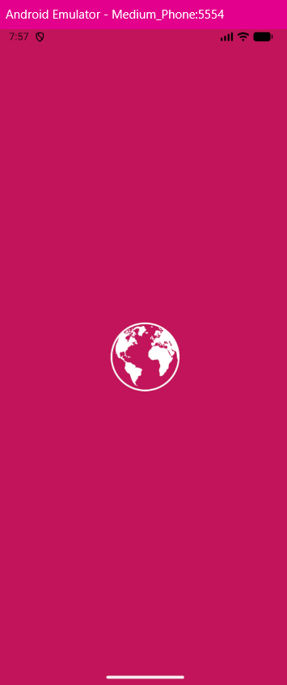
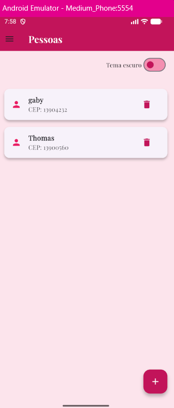
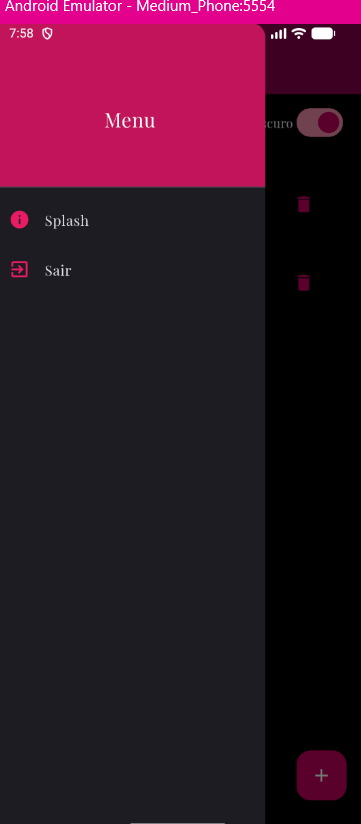
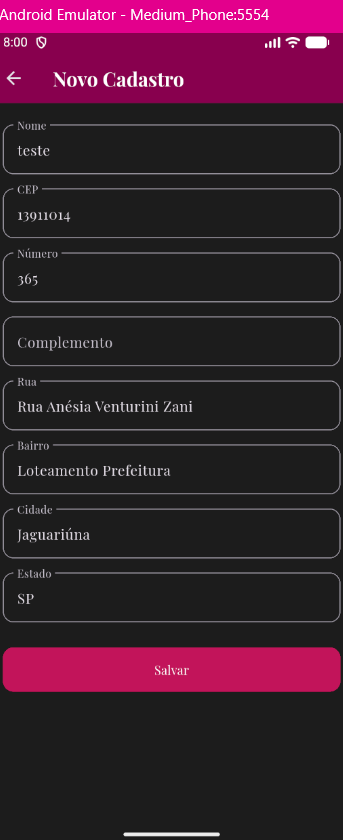

# 📱 Projeto CEP — Aplicativo Flutter

Este projeto foi desenvolvido como parte dos desafios do curso **SENAI Jaguariúna**.  
O aplicativo permite **cadastrar pessoas**, **consultar endereços via API ViaCEP**, e **salvar os dados localmente** no celular.

---

## 🧩 Funcionalidades

- Tela **Splash** com animação de entrada.
- Tela **Home** com lista de cadastros (Nome + CEP).
- Tela **Cadastro** com integração à **API ViaCEP**.
- Campos automáticos (Rua, Bairro, Cidade, Estado) preenchidos pela API.
- Salvamento local com **SharedPreferences**.
- Alternância entre **tema claro e escuro**.
- Menu lateral com opções:
  - 🏠 Home
  - 💫 Splash
  - 🚪 Sair (encerra o app)

---

## 🧠 Tecnologias utilizadas

| Tecnologia | Função |
|-----------|--------|
| Flutter | Framework principal |
| Dart | Linguagem de programação |
| SharedPreferences | Armazenamento local |
| HTTP | Comunicação com API ViaCEP |
| Google Fonts | Fonte Playfair Display |
| Flutter Launcher Icons | Ícone do aplicativo |

---

## 🎨 Tema e Fonte

- **Fonte:** [Playfair Display](https://fonts.google.com/specimen/Playfair+Display)
- **Paleta de cores:**
  - Rosa principal: `#E91E63`
  - Fundo claro: `#FCE4EC`
  - Fundo escuro: `#1E1E1E`

---

## 🌐 API Externa (ViaCEP)

O app consome a **API pública ViaCEP** para buscar informações de endereço a partir do CEP digitado:

```
https://viacep.com.br/ws/{cep}/json/
```

---

## 🖼️ Imagens do Aplicativo

### Splash


### Home


### Menu


### Cadastro



## ⚙️ Estrutura de pastas

```
lib/
 ├── models/
 │    └── pessoa.dart
 ├── screens/
 │    ├── splash.dart
 │    ├── home.dart
 │    └── cadastro.dart
 ├── services/
 │    └── via_cep_service.dart
 └── main.dart

assets/
 └── prints/
      ├── splash.png
      ├── home.png
      ├── menu.png
      └── cadastro.png
  └── logo.png
```

---

## 🧑‍💻 Autor

Desenvolvido por **[Seu Nome]**  
Curso: **Desenvolvimento de Sistemas**  
Ano: **2026**

---

## 🚀 Execução

Para rodar o projeto:

```
flutter pub get
flutter run
```

---

## 📝 Observações

- O tema escuro é global e afeta todas as telas.
- O botão “Sair” funciona apenas em emuladores ou dispositivos físicos.
- Os wireframes são ilustrativos — o layout foi adaptado para uma aparência moderna e intuitiva.
```